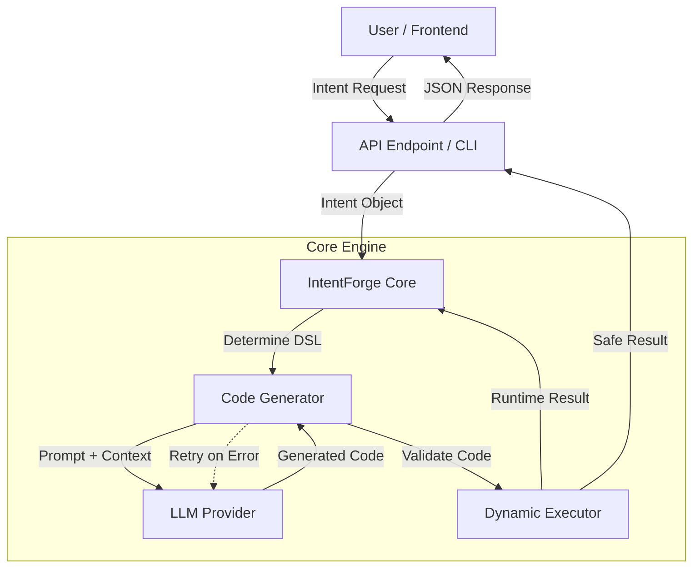

# Architecture Overview

**[🏠 Home](INDEX.md) | [⚙️ Setup](setup.md) | [🛠️ Usage](usage.md) | [🏗️ Architecture](architecture.md) | [📚 API](api.md)**

IntentForge operates as a bridge between Natural Language Intents and Executable Code.

## Key Components

### 1. IntentForge Core ([`intentforge.core`](../intentforge/core.py))
The main orchestrator. It manages the lifecycle of an intent from reception to execution.

### 2. Code Generator ([`intentforge.generator`](../intentforge/generator.py))
Responsible for converting natural language descriptions into executable code. It uses a **Generate-Validate-Fix** loop:
- **DSL Handling**: Detects intent type (Workflow, SQL, DOM, etc.).
- **LLM Integration**: Calls the configured provider.
- **Self-Correction**: Feeds validation errors back to the LLM for refined generation.

### 3. Dynamic Executor ([`intentforge.executor`](../intentforge/executor.py))
Safely executes the generated code.
- **Sandbox**: Restricts access to dangerous modules (`os`, `sys`, `subprocess`) unless explicitly allowed.
- **Validation**: Performs static analysis (AST) before execution.

### 4. LLM Providers ([`intentforge.llm`](../intentforge/llm/__init__.py))
A unified interface for different LLM backends:
- **Ollama**: Local inference.
- **Anthropic / OpenAI**: Cloud inference.
